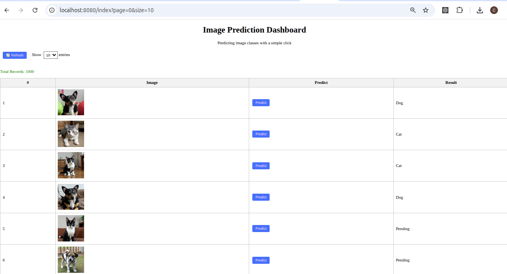

# 🐶🐱 DL4J Dog-and-Cat Image Classifier (Spring Boot + DeepLearning4J)
This project builds a simple **Image Classifier** using **DeepLearning4J (DL4J)** to identify whether an image is of a **dog** or a **cat**. It's written in **Java** and uses a **Convolutional Neural Network (CNN)** to train and predict.

---

## 📌 Goal

To train a model that can classify an image as a **dog** or a **cat** using a labeled image dataset.

---

## ⚙️ Technologies & Tools Used

| Tool / Library        | Purpose                                 |
|-----------------------|------------------------------------------|
| Java                  | Programming language                    |
| DeepLearning4J (DL4J) | Deep learning library                   |
| ND4J                  | Scientific computing library            |
| DataVec               | Data preprocessing (images, labels)     |
| Gradle                | Dependency management                   |

---

## 🧠 Concepts Used

| Concept                      | Explanation |
|-----------------------------|-------------|
| **CNN (Convolutional Neural Network)** | A type of neural network that works well with image data. |
| **Image Preprocessing**     | Resizing and scaling images to feed into the model. |
| **Train/Test Split**        | Separating the dataset to train the model and test its performance. |
| **One-hot Encoding**        | Converting class labels (dog/cat) into numerical form. |
| **Model Evaluation**        | Measuring how accurate the model is on test data. |
| **Model Serialization**     | Saving the trained model to use it later without retraining. |

---

## 📂 Dataset

We use the **Dog-and-Cat Dataset** from Kaggle:    
👉 [Download Here] (https://www.kaggle.com/datasets/anthonytherrien/dog-vs-cat)

**Folder structure (after extraction):**
```aiignore
src/main/resources/
├── dataset/
│ ├── cat/
│ │ ├── cat001.jpg
│ │ └── ...
│ └── dog/
│ ├── dog001.jpg
```


---

## 🛠 Prerequisites

- Java 17+
- Gradle 8+
- At least 2 GB RAM

---

## 📦 Gradle Dependencies

Add the following to your `build.gradleF`:

```gradle
// DeepLearning4j Core
implementation("org.deeplearning4j:deeplearning4j-core:1.0.0-M2.1")
//ND4J Backend
implementation("org.nd4j:nd4j-native-platform:1.0.0-M2.1")
//DataVec for preprocessing
implementation("org.datavec:datavec-api:1.0.0-M2.1")
```
### 🏗 Project Structure

```src
src/
│── main/
│   │──java/com.aimodel.mageclassifier/
│   │    ├── controller/mageClassifierController.java
│   │    ├── service/ImageClassifierService.java
│   │    ├── model/PredictionResult.java
│   │    ├── training/ImageClassifierTrainer.java
│   └── ImageClassifierApplication.java
│   └── resources/
│       ├── static/
│       │   ├── css/            <-- CSS files for styling
│       │   ├── js/             <-- JavaScript files for interactivity
│       ├── datasets/       <-- Stores images
│       │   ├── cat/        <-- Cat images  
│       │   ├── dog/        <-- Dog images
│       ├── templates/
│       │   └── index.html        <-- Thymeleaf UI
│       └── application.properties

```
## 🚀 Run the Application

1. Run the `ImageClassifierTrainer` class to generate and save the model `(image-model.zip)` on root folder.
2. Run the Spring Boot app (`mvn spring-boot:run` or run your main app class).


### 🔍 How to Use
* Make sure image-classifier-model.zip exists in the root/ directory.
* Run the Spring Boot app.
* Use Postman or curl to upload an image:
```bash
curl -X POST http://localhost:8080/api/image/predict \
  -F file=@path_to_cat_or_dog_image.jpg

````
---

## 🚀 How It Works (Workflow)

1. **Load Dataset:** Read images from `dog/` and `cat/` folders.
2. **Label Images:** Automatically label them using folder names.
3. **Preprocess Images:** Resize to 100x100 pixels, normalize pixel values.
4. **Split Data:** Use 80% images for training, 20% for testing.
5. **Build CNN Model:** Create a convolutional neural network with multiple layers.
6. **Train Model:** Train the model over 10 epochs using the training data.
7. **Evaluate:** Use test data to check model performance (accuracy, precision, etc.).
8. **Save Model:** Save trained model (image-model) to a `.zip` file.
9. **Predict:** Later, load the model and pass any image to classify as dog or cat.

---

## 📊 Output Example
After training and evaluation, you will see a report like:
```aiignore
Accuracy: 87.5%
Precision: 86.7%
Recall: 88.0%
F1 Score: 87.3%
```

---

## 🖥️ UI Overview (`index.html`)

The `index.html` page provides a web-based interface to interact with the Kaggle Telco Customer Churn dataset and the trained DL4J model.

### 🔧 Features

| Feature           | Description |
|------------------|-------------|
| Load Data         | Automatically loads the cleaned dataset and displays it in a table |
| Search Box        | Allows filtering the table by `customerID` |
| Data Table        | Shows customer details like `gender`, `tenure`, `MonthlyCharges`, etc. |
| Predict Button    | Each row has a **Predict** button to generate churn probability |
| Prediction Column | Displays churn result next to each row (e.g., `Churn: Yes (0.8243)`) |

### UI Screenshot


### 🔁 How Prediction Works

1. User clicks "Predict"
2. The row's data is sent to the `/predict` endpoint via JavaScript
3. Backend:
  - Loads `churn-model.zip`
  - Applies `transformProcess.json`
  - Returns churn probability
4. UI updates the result cell with prediction


---

## ❗ Important Notes

- This model performs best on **images similar to the training set**.
- It may not generalize well to completely new or very different images unless:
    - You add more training data
    - Use data augmentation
    - Use pre-trained models (transfer learning)

---

## ✅ Next Steps (Optional Improvements)

| Feature                    | Description |
|---------------------------|-------------|
| 🔄 Add Transfer Learning   | Use models like VGG16 for better accuracy |
| 🧹 Improve Dataset         | Clean and balance the dataset |
| 🧠 Add Augmentation        | Train with flipped, rotated, or zoomed images |

---
## 📝 Glossary
### Epochs:
In the context of machine learning, an epoch refers to one complete pass through the entire training dataset during the training process.

### One-Hot Encoding
When you have categorical data (like "dog"/"cat" or "0" / "1"), neural networks can't understand these as strings. They only understand numbers.

## 🙏 Acknowledgements
- [DeepLearning4J Official Docs] (https://deeplearning4j.konduit.ai/)
- [Kaggle - Dog and Cat Dataset] (https://www.kaggle.com/datasets/anthonytherrien/dog-vs-cat)

---

## 📜 License
This project is free to use under the **MIT License**.
